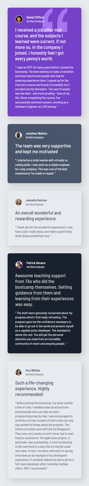
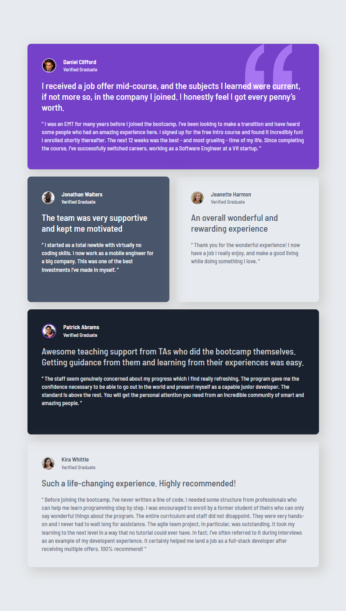
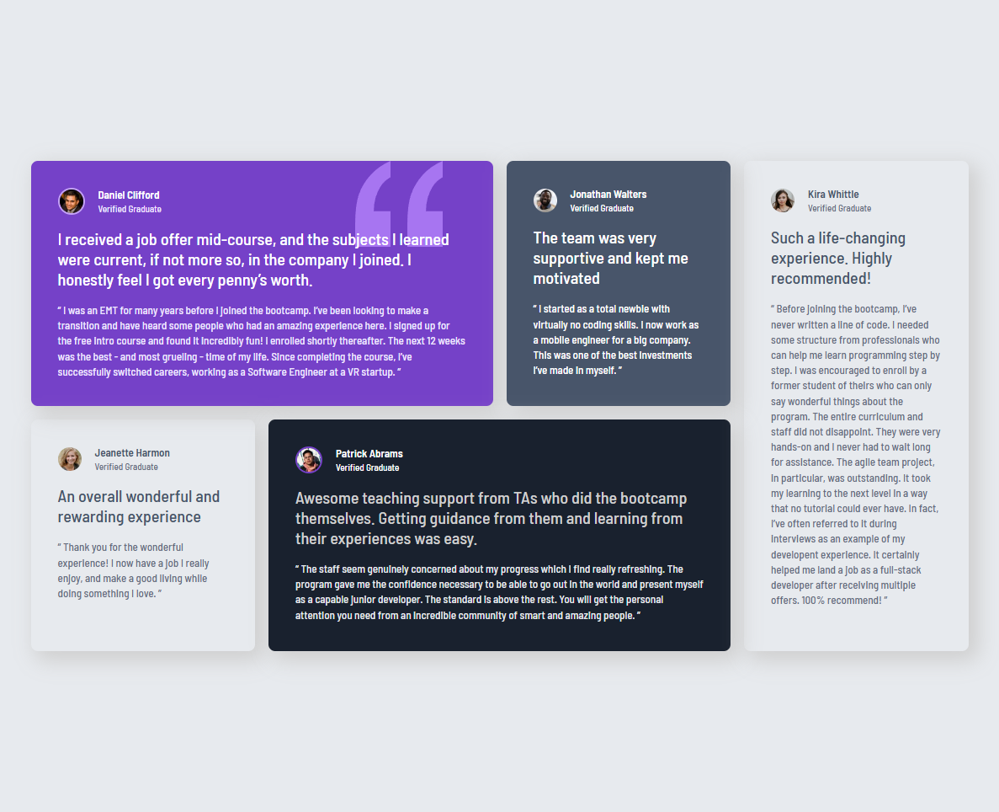

# Testimonials 🚀

## Overview
This is a simple testimonial page that uses both grid and flexbox.

Built to be responsive depending on device size.

### Built With

🔴 Mobile First

🔴 Google Fonts

🔴 Semantic HTML

🔴 CSS Custom Properties

🔴 CSS Grid & Flex

### Preview

  

    <b>Mobile Design:</b>
  

  

  

  

  

    <b>Tablet Design:</b>
  

  

    

  

  

    <b>Desktop Design:</b>
  

  

    

  

## Update Progress

### March 21st, 2026

Updated colors within the cards

### March 16th, 2026

Condensed duplicate CSS

Fixed Media Queries

### March 15th, 2026

Created profile section using flex

Minor updates to some padding

### March 13th, 2026

Updates to media queries

Desktop Layout Complete

### March 9th, 2026

Established a CSS reset

Created a content container and used grid to align the content

Updated colors and padding

### March 8th, 2026

Initial commit

Sorted through HTML and added semantic tags and classes

Eneablend CSS variables
